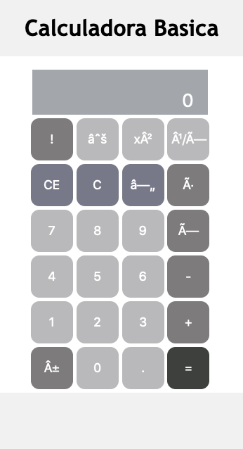

# Calculadora Basica

Esta es una app de ejemplo para la clase de Tecnologías Emergentes para el desarrollo de Software de la Universidad del Norte, 2020.

```
El proyecto consiste en una calculadora, la cual puede hacer las funciones basicas, además del
factorial
```

